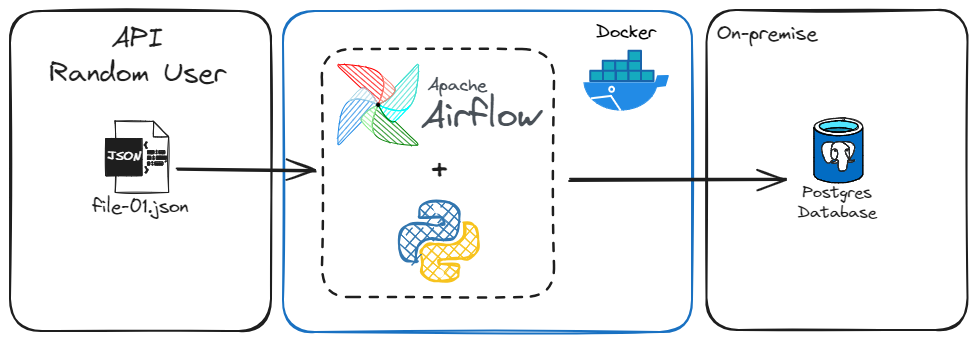
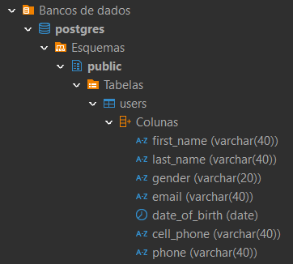
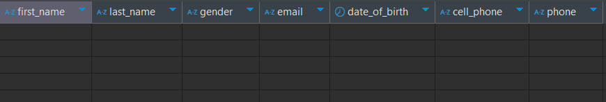
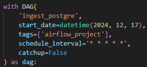
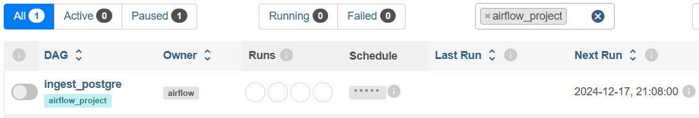
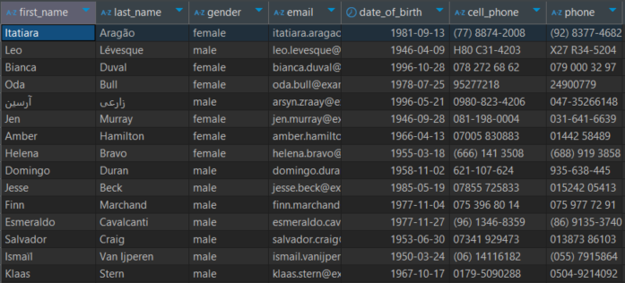
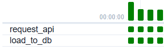
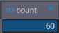

# postgres_ingestion_airflow

> Author: Danilo Machado

## Introdução

As ferramentas de orquestração de pipeline de dados desempenham um papel essencial no dia a dia de trabalho do engenheiro de dados. Neste projeto, foi utilizado o Apache Airflow, instalado numa máquina local e rodando dentro de um contâiner no Docker, para automatizar a ingestão de dados provenientes de uma API dentro do banco de dados PostgreSQL on-premise. Os dados utilizados são do site [Random User Generator API](https://randomuser.me/documentation), sendo fictícios e apenas para fins didáticos. Para este projeto, foi selecionado o número de [15 registros por requisição](https://randomuser.me/api/?results=15).

## Depedências do projeto
- [Python 3.13](https://www.python.org)
- [Docker](https://docs.docker.com/)
- [Apache Airflow](https://airflow.apache.org/docs/)
- [PostreSQL](https://www.postgresql.org/docs/)

## Bibliotecas e módulos utilizados
- pandas
- requests
- configparser
- sqlalchemy
- datetime
- airflow
- airflow.operators.python

## Execução do projeto

A figura a seguir apresenta o pipeline de dados deste projeto:

O script **postgres_ingestion.py** executa uma requisição na API do site e recebe os dados em formato JSON. Em seguida, o script seleciona os dados de interesse e cria um DataFrame, o qual pode ser carregado diretamente no banco de dados. No entanto, para controlar os tipos de cada coluna, foi criada a tabela **users** com as colunas já formatadas usando o script **create_table.sql**. As figuras a seguir mostram a tabela criada com suas colunas pré formatadas:

### Criação da DAG para orquestração

Na criação da DAG que será executada pelo Apache Airflow para execução do fluxo de trabalho, foi adicionada a tag **airflow_project** para facilitar encontrá-la ao acessar a interface do Airflow, como mostram as figuras a seguir. Note a definição de agendamento (**schedule_interval**), que neste caso implica em uma execução por minuto enquanto a DAG estiver ativa. 

Após a primeira execução, temos a primeira ingestão de dados, com 15 novos registros como se pode ver nas imagens abaixo:

E após 4 minutos com a DAG ativa, temos 4 execuções bem sucedidas e, portanto, um total de 60 registros:

Embora simples, este projeto pode ser uma base para uma aplicação mais robusta em um cenário real, onde são feitas requisições em API's para ingestão em bancos de dados, Data Warehouse ou Data Lake.